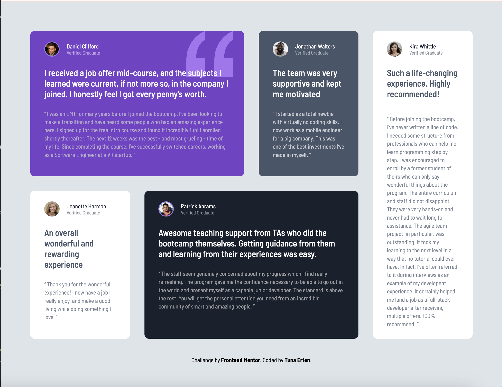

# Frontend Mentor - Testimonials grid section solution

This is a solution to the [Testimonials grid section challenge on Frontend Mentor](https://www.frontendmentor.io/challenges/testimonials-grid-section-Nnw6J7Un7). Frontend Mentor challenges help you improve your coding skills by building realistic projects.

## Table of contents

- [The challenge](#the-challenge)
- [Screenshot](#screenshot)
- [Links](#links)
- [Built with](#built-with)
- [What I learned](#what-i-learned)

## Overview

### The challenge

Users should be able to:

- View the optimal layout for the site depending on their device's screen size

### Screenshot

### Links

- Solution URL: [https://github.com/tunaerten/testimonials]
- Live Site URL: [https://testimonials-erten.netlify.app/]

## My process

### Built with

- Semantic HTML5 markup
- CSS custom properties
- Flexbox
- CSS Grid
- Mobile-first workflow

### What I learned

I became more familiar with the grid concept, which I wasn't very accustomed to before. I realized I needed to do some research and reading about grids. It seemed more complicated than Flex, but now I understand it better. Especially in the desktop version, I became more accustomed to the placement and ordering of grids. It took me a long time to finish the project because there was a gap in time, and unfortunately, I had to remember and review the old code at each restart. However, I believe I have a much better understanding of the grid system now. The challenges are really well-prepared and improve practice with each step.
